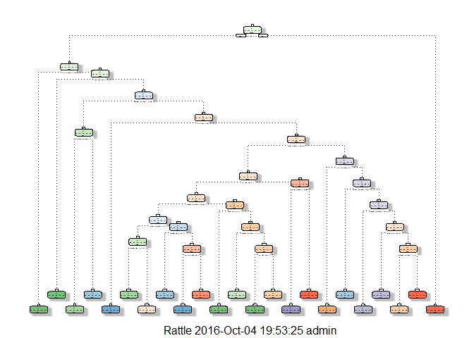
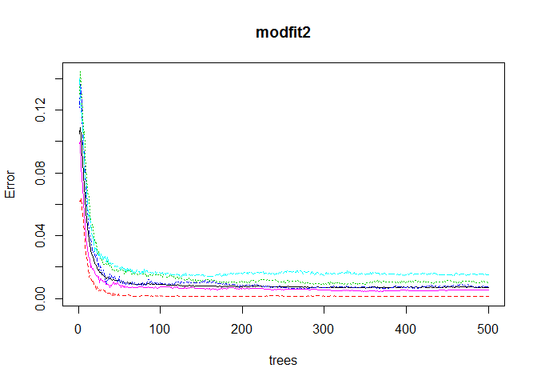

Synopsis:
---------

Jawbone Up, Nike FuelBand, and Fitbit are devices used to collect a
large amount of data about personal activity relatively inexpensively.
Most of the people regularly quantify how much of a particular activity
they do, and rarely quantify how well they do it. Using the above
mentioned devices,people take measurements about themselves regularly to
improve their health, or to find patterns in their behavior. In this
project, our goal is to use the data from accelerometers on the belt,
forearm, arm, and dumbell of 6 participants and predict the manner in
which the did the exercise. This is quantified by the 'classe' variable
in the training data set.

Downloading the data set:
-------------------------

The training dataset is available in the link:
<https://d396qusza40orc.cloudfront.net/predmachlearn/pml-training.csv>

The testing dataset is available in the link:
<https://d396qusza40orc.cloudfront.net/predmachlearn/pml-testing.csv>

Now, let's download both the dataset and use the same for building and
testing the model.

    ##required libraries
    suppressPackageStartupMessages(library(caret))

    ## Warning: package 'caret' was built under R version 3.3.1

    ## Warning: package 'lattice' was built under R version 3.3.1

    ## Warning: package 'ggplot2' was built under R version 3.3.1

    ##download files
    set.seed(12345)
    download.file("https://d396qusza40orc.cloudfront.net/predmachlearn/pml-training.csv","training.csv")
    download.file("https://d396qusza40orc.cloudfront.net/predmachlearn/pml-testing.csv","testing.csv")
    training <- read.csv("training.csv",na.strings = c("NA","#DIV/0!",""))
    testing <- read.csv("testing.csv",na.strings = c("NA","#DIV/0!",""))
    dim(training)

    ## [1] 19622   160

    dim(testing)

    ## [1]  20 160

Cleaning the datasets:
----------------------

Before cleaning the datasets, let's first check the column names of the
datasets.

    names_train <- colnames(training)
    names_train
    names_test <- colnames(testing)
    names_test

On seeing the column names of both the datasets(the column names are not
shown here), we find that the first 7 columns are unnecessary for our
prediction. So we can remove those columns and also we find the final
column in training and testing dataset varies(i.e) the column name is
'classe' in the training dataset and 'problem\_id' in the testing
dataset. We also can remove all the columns which have NAs in them. Lets
do the cleaning of the datasets now.

    ##find the columns which has NAs in it
    na_index <- NULL
    for(i in 1:dim(training)[2])
    {
      ifelse(is.na(training[,i]),na_index <- c(na_index,i),0)
    }
    ##Now, remove the first 7 columns and the columns which has NAs in both testing and training sets
    nondrops <- NULL
    nondrops <- c(nondrops,names(training[,-c(1:7,na_index)]))
    final_train <- training[,names(training)%in% nondrops]
    names(final_train)

    ##  [1] "roll_belt"            "pitch_belt"           "yaw_belt"            
    ##  [4] "total_accel_belt"     "gyros_belt_x"         "gyros_belt_y"        
    ##  [7] "gyros_belt_z"         "accel_belt_x"         "accel_belt_y"        
    ## [10] "accel_belt_z"         "magnet_belt_x"        "magnet_belt_y"       
    ## [13] "magnet_belt_z"        "roll_arm"             "pitch_arm"           
    ## [16] "yaw_arm"              "total_accel_arm"      "gyros_arm_x"         
    ## [19] "gyros_arm_y"          "gyros_arm_z"          "accel_arm_x"         
    ## [22] "accel_arm_y"          "accel_arm_z"          "magnet_arm_x"        
    ## [25] "magnet_arm_y"         "magnet_arm_z"         "roll_dumbbell"       
    ## [28] "pitch_dumbbell"       "yaw_dumbbell"         "total_accel_dumbbell"
    ## [31] "gyros_dumbbell_x"     "gyros_dumbbell_y"     "gyros_dumbbell_z"    
    ## [34] "accel_dumbbell_x"     "accel_dumbbell_y"     "accel_dumbbell_z"    
    ## [37] "magnet_dumbbell_x"    "magnet_dumbbell_y"    "magnet_dumbbell_z"   
    ## [40] "roll_forearm"         "pitch_forearm"        "yaw_forearm"         
    ## [43] "total_accel_forearm"  "gyros_forearm_x"      "gyros_forearm_y"     
    ## [46] "gyros_forearm_z"      "accel_forearm_x"      "accel_forearm_y"     
    ## [49] "accel_forearm_z"      "magnet_forearm_x"     "magnet_forearm_y"    
    ## [52] "magnet_forearm_z"     "classe"

    nondrops <- NULL
    nondrops <- c(nondrops,names(testing[,-c(1:7,na_index)]))
    final_test <- testing[,names(testing)%in% nondrops]
    names(final_test)

    ##  [1] "roll_belt"            "pitch_belt"           "yaw_belt"            
    ##  [4] "total_accel_belt"     "gyros_belt_x"         "gyros_belt_y"        
    ##  [7] "gyros_belt_z"         "accel_belt_x"         "accel_belt_y"        
    ## [10] "accel_belt_z"         "magnet_belt_x"        "magnet_belt_y"       
    ## [13] "magnet_belt_z"        "roll_arm"             "pitch_arm"           
    ## [16] "yaw_arm"              "total_accel_arm"      "gyros_arm_x"         
    ## [19] "gyros_arm_y"          "gyros_arm_z"          "accel_arm_x"         
    ## [22] "accel_arm_y"          "accel_arm_z"          "magnet_arm_x"        
    ## [25] "magnet_arm_y"         "magnet_arm_z"         "roll_dumbbell"       
    ## [28] "pitch_dumbbell"       "yaw_dumbbell"         "total_accel_dumbbell"
    ## [31] "gyros_dumbbell_x"     "gyros_dumbbell_y"     "gyros_dumbbell_z"    
    ## [34] "accel_dumbbell_x"     "accel_dumbbell_y"     "accel_dumbbell_z"    
    ## [37] "magnet_dumbbell_x"    "magnet_dumbbell_y"    "magnet_dumbbell_z"   
    ## [40] "roll_forearm"         "pitch_forearm"        "yaw_forearm"         
    ## [43] "total_accel_forearm"  "gyros_forearm_x"      "gyros_forearm_y"     
    ## [46] "gyros_forearm_z"      "accel_forearm_x"      "accel_forearm_y"     
    ## [49] "accel_forearm_z"      "magnet_forearm_x"     "magnet_forearm_y"    
    ## [52] "magnet_forearm_z"     "problem_id"

Now, let's remove the covariates which have zero variability.

    suppressPackageStartupMessages(library(caret))
    nzv <- nearZeroVar(final_train,saveMetrics = TRUE)
    nzv

    ##                      freqRatio percentUnique zeroVar   nzv
    ## roll_belt             1.101904     6.7781062   FALSE FALSE
    ## pitch_belt            1.036082     9.3772296   FALSE FALSE
    ## yaw_belt              1.058480     9.9734991   FALSE FALSE
    ## total_accel_belt      1.063160     0.1477933   FALSE FALSE
    ## gyros_belt_x          1.058651     0.7134849   FALSE FALSE
    ## gyros_belt_y          1.144000     0.3516461   FALSE FALSE
    ## gyros_belt_z          1.066214     0.8612782   FALSE FALSE
    ## accel_belt_x          1.055412     0.8357966   FALSE FALSE
    ## accel_belt_y          1.113725     0.7287738   FALSE FALSE
    ## accel_belt_z          1.078767     1.5237998   FALSE FALSE
    ## magnet_belt_x         1.090141     1.6664968   FALSE FALSE
    ## magnet_belt_y         1.099688     1.5187035   FALSE FALSE
    ## magnet_belt_z         1.006369     2.3290184   FALSE FALSE
    ## roll_arm             52.338462    13.5256345   FALSE FALSE
    ## pitch_arm            87.256410    15.7323412   FALSE FALSE
    ## yaw_arm              33.029126    14.6570176   FALSE FALSE
    ## total_accel_arm       1.024526     0.3363572   FALSE FALSE
    ## gyros_arm_x           1.015504     3.2769341   FALSE FALSE
    ## gyros_arm_y           1.454369     1.9162165   FALSE FALSE
    ## gyros_arm_z           1.110687     1.2638875   FALSE FALSE
    ## accel_arm_x           1.017341     3.9598410   FALSE FALSE
    ## accel_arm_y           1.140187     2.7367241   FALSE FALSE
    ## accel_arm_z           1.128000     4.0362858   FALSE FALSE
    ## magnet_arm_x          1.000000     6.8239731   FALSE FALSE
    ## magnet_arm_y          1.056818     4.4439914   FALSE FALSE
    ## magnet_arm_z          1.036364     6.4468454   FALSE FALSE
    ## roll_dumbbell         1.022388    84.2065029   FALSE FALSE
    ## pitch_dumbbell        2.277372    81.7449801   FALSE FALSE
    ## yaw_dumbbell          1.132231    83.4828254   FALSE FALSE
    ## total_accel_dumbbell  1.072634     0.2191418   FALSE FALSE
    ## gyros_dumbbell_x      1.003268     1.2282132   FALSE FALSE
    ## gyros_dumbbell_y      1.264957     1.4167771   FALSE FALSE
    ## gyros_dumbbell_z      1.060100     1.0498420   FALSE FALSE
    ## accel_dumbbell_x      1.018018     2.1659362   FALSE FALSE
    ## accel_dumbbell_y      1.053061     2.3748853   FALSE FALSE
    ## accel_dumbbell_z      1.133333     2.0894914   FALSE FALSE
    ## magnet_dumbbell_x     1.098266     5.7486495   FALSE FALSE
    ## magnet_dumbbell_y     1.197740     4.3012945   FALSE FALSE
    ## magnet_dumbbell_z     1.020833     3.4451126   FALSE FALSE
    ## roll_forearm         11.589286    11.0895933   FALSE FALSE
    ## pitch_forearm        65.983051    14.8557741   FALSE FALSE
    ## yaw_forearm          15.322835    10.1467740   FALSE FALSE
    ## total_accel_forearm   1.128928     0.3567424   FALSE FALSE
    ## gyros_forearm_x       1.059273     1.5187035   FALSE FALSE
    ## gyros_forearm_y       1.036554     3.7763735   FALSE FALSE
    ## gyros_forearm_z       1.122917     1.5645704   FALSE FALSE
    ## accel_forearm_x       1.126437     4.0464784   FALSE FALSE
    ## accel_forearm_y       1.059406     5.1116094   FALSE FALSE
    ## accel_forearm_z       1.006250     2.9558659   FALSE FALSE
    ## magnet_forearm_x      1.012346     7.7667924   FALSE FALSE
    ## magnet_forearm_y      1.246914     9.5403119   FALSE FALSE
    ## magnet_forearm_z      1.000000     8.5771073   FALSE FALSE
    ## classe                1.469581     0.0254816   FALSE FALSE

There are no varaiables with zero variability. So, we can proceed with
the dataset as such without eliminating any columns further.

Cross-validation datasets:
--------------------------

For cross-validation, let's further partition our training dataset into
two sets: training and testing sets to build few models and select the
best model among them.

    inTrain <- createDataPartition(final_train$classe,p=0.6,list=FALSE)
    cv_training <- final_train[inTrain,]
    cv_testing <- final_train[-inTrain,]
    dim(cv_training)

    ## [1] 11776    53

    dim(cv_testing)

    ## [1] 7846   53

Prediction Algorithm 1 : Decision Trees
---------------------------------------

Now let's start the building of various models. First let's do with the
decision trees.

    suppressPackageStartupMessages(library(rattle))

    ## Warning: package 'rattle' was built under R version 3.3.1

    suppressPackageStartupMessages(library(rpart))

    ## Warning: package 'rpart' was built under R version 3.3.1

    suppressPackageStartupMessages(library(rpart.plot))

    ## Warning: package 'rpart.plot' was built under R version 3.3.1

    modfit1 <- rpart(classe~.,data=cv_training,method="class")
    fancyRpartPlot(modfit1)

Now using this built model, lets predict for the testing set and check
the accuracy of this model.

    prediction1 <- predict(modfit1,cv_testing,type="class")
    acc1 <- confusionMatrix(prediction1,cv_testing$classe)
    acc1

    ## Confusion Matrix and Statistics
    ## 
    ##           Reference
    ## Prediction    A    B    C    D    E
    ##          A 1879  260   30   69   66
    ##          B   56  759   88   34   54
    ##          C  105  340 1226  354  234
    ##          D  155  132   23  807   57
    ##          E   37   27    1   22 1031
    ## 
    ## Overall Statistics
    ##                                           
    ##                Accuracy : 0.7267          
    ##                  95% CI : (0.7167, 0.7366)
    ##     No Information Rate : 0.2845          
    ##     P-Value [Acc > NIR] : < 2.2e-16       
    ##                                           
    ##                   Kappa : 0.6546          
    ##  Mcnemar's Test P-Value : < 2.2e-16       
    ## 
    ## Statistics by Class:
    ## 
    ##                      Class: A Class: B Class: C Class: D Class: E
    ## Sensitivity            0.8418  0.50000   0.8962   0.6275   0.7150
    ## Specificity            0.9243  0.96334   0.8405   0.9441   0.9864
    ## Pos Pred Value         0.8155  0.76589   0.5427   0.6874   0.9222
    ## Neg Pred Value         0.9363  0.88928   0.9746   0.9282   0.9389
    ## Prevalence             0.2845  0.19347   0.1744   0.1639   0.1838
    ## Detection Rate         0.2395  0.09674   0.1563   0.1029   0.1314
    ## Detection Prevalence   0.2937  0.12631   0.2879   0.1496   0.1425
    ## Balanced Accuracy      0.8831  0.73167   0.8684   0.7858   0.8507

From the results, we have got an accuracy of 73.27%.

Prediction Algorithm 2 - Random Forests:
----------------------------------------

Now lets build a model using Random Forests.

    suppressPackageStartupMessages(library(randomForest))

    ## Warning: package 'randomForest' was built under R version 3.3.1

    modfit2 <- randomForest(classe~.,data=cv_training)
    prediction2 <- predict(modfit2,cv_testing,type="class")
    acc2 <- confusionMatrix(prediction2,cv_testing$classe)
    acc2

    ## Confusion Matrix and Statistics
    ## 
    ##           Reference
    ## Prediction    A    B    C    D    E
    ##          A 2229    7    0    0    0
    ##          B    3 1505    5    0    0
    ##          C    0    6 1363   16    2
    ##          D    0    0    0 1268    4
    ##          E    0    0    0    2 1436
    ## 
    ## Overall Statistics
    ##                                           
    ##                Accuracy : 0.9943          
    ##                  95% CI : (0.9923, 0.9958)
    ##     No Information Rate : 0.2845          
    ##     P-Value [Acc > NIR] : < 2.2e-16       
    ##                                           
    ##                   Kappa : 0.9927          
    ##  Mcnemar's Test P-Value : NA              
    ## 
    ## Statistics by Class:
    ## 
    ##                      Class: A Class: B Class: C Class: D Class: E
    ## Sensitivity            0.9987   0.9914   0.9963   0.9860   0.9958
    ## Specificity            0.9988   0.9987   0.9963   0.9994   0.9997
    ## Pos Pred Value         0.9969   0.9947   0.9827   0.9969   0.9986
    ## Neg Pred Value         0.9995   0.9979   0.9992   0.9973   0.9991
    ## Prevalence             0.2845   0.1935   0.1744   0.1639   0.1838
    ## Detection Rate         0.2841   0.1918   0.1737   0.1616   0.1830
    ## Detection Prevalence   0.2850   0.1928   0.1768   0.1621   0.1833
    ## Balanced Accuracy      0.9987   0.9951   0.9963   0.9927   0.9978

From the results, we see that we have got an accuracy of 99.29%.

    plot(modfit2)

Prediction Algorithm 3 - Generalised Boosting Regression:
---------------------------------------------------------

Now lets build a model using Generalised Boosting Regression.

    fitControl <- trainControl(method = "repeatedcv",number = 5,repeats = 1)
    modfit3 <- train(classe~.,data=cv_training,method="gbm",trControl=fitControl,verbose=FALSE)

    ## Loading required package: gbm

    ## Warning: package 'gbm' was built under R version 3.3.1

    ## Loading required package: survival

    ## 
    ## Attaching package: 'survival'

    ## The following object is masked from 'package:caret':
    ## 
    ##     cluster

    ## Loading required package: splines

    ## Loading required package: parallel

    ## Loaded gbm 2.1.1

    ## Loading required package: plyr

    ## Warning: package 'plyr' was built under R version 3.3.1

    prediction3 <- predict(modfit3,newdata=cv_testing)
    acc3 <- confusionMatrix(prediction3,cv_testing$classe)
    acc3

    ## Confusion Matrix and Statistics
    ## 
    ##           Reference
    ## Prediction    A    B    C    D    E
    ##          A 2204   46    0    3    0
    ##          B   21 1427   40    5   16
    ##          C    5   35 1311   50   18
    ##          D    2    4   17 1220   21
    ##          E    0    6    0    8 1387
    ## 
    ## Overall Statistics
    ##                                           
    ##                Accuracy : 0.9621          
    ##                  95% CI : (0.9577, 0.9663)
    ##     No Information Rate : 0.2845          
    ##     P-Value [Acc > NIR] : < 2.2e-16       
    ##                                           
    ##                   Kappa : 0.9521          
    ##  Mcnemar's Test P-Value : NA              
    ## 
    ## Statistics by Class:
    ## 
    ##                      Class: A Class: B Class: C Class: D Class: E
    ## Sensitivity            0.9875   0.9401   0.9583   0.9487   0.9619
    ## Specificity            0.9913   0.9870   0.9833   0.9933   0.9978
    ## Pos Pred Value         0.9783   0.9457   0.9239   0.9652   0.9900
    ## Neg Pred Value         0.9950   0.9856   0.9911   0.9900   0.9915
    ## Prevalence             0.2845   0.1935   0.1744   0.1639   0.1838
    ## Detection Rate         0.2809   0.1819   0.1671   0.1555   0.1768
    ## Detection Prevalence   0.2872   0.1923   0.1809   0.1611   0.1786
    ## Balanced Accuracy      0.9894   0.9635   0.9708   0.9710   0.9798

From the results, we find an accuracy of 96.29%.

Predicting test data with the best method:
------------------------------------------

From the above three methods, we find that the Random Forests model
gives a higher accuracy than the other two methods(decision trees and
generalized boosting method). So with the random forests model, lets
predict the original test dataset.

    predictresult <- predict(modfit2,newdata=final_test)
    predictresult

    ##  1  2  3  4  5  6  7  8  9 10 11 12 13 14 15 16 17 18 19 20 
    ##  B  A  B  A  A  E  D  B  A  A  B  C  B  A  E  E  A  B  B  B 
    ## Levels: A B C D E

Conclusion:
-----------

-Thus, we tried 3 methods(decision trees, random forests and generalized
boosting method) for prediction.  
-We found that the random forests gave a higher accuracy for the
cross-validated test dataset.  
-The out-of-sample error for the random forests method is = 100-99.29 =
0.71%.
